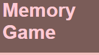
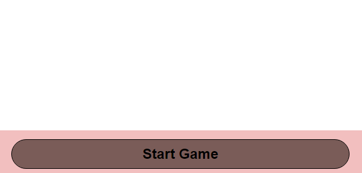
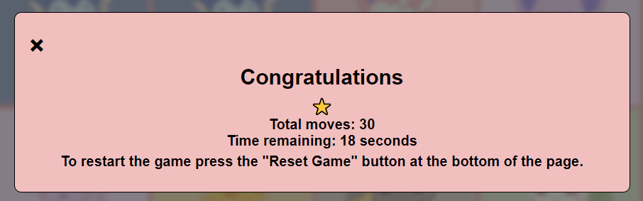

# Eeeve's evolution memory game

## Welcome to Eeevee's evolution memory game, help Eevee reach his final form

In this game you will match cards with eachother to help Eevee evolve, there are several cards with Eevee's different forms to match.

- Score points by matching pairs.
- Win by matching all of them.
- If you need information how to play press the info icon located at the top right.
- Have fun!

## [Live site](https://jonathan97-web.github.io/Eevees-evolution/)

[Am I responsive website](https://ui.dev/amiresponsive?url=https://jonathan97-web.github.io/PP2-JS)

## UX

### Colour Scheme

Explain your colours and the colour scheme.

- `#000000` used for borders.
- `#7A5C58` used for background elements.
- `#F2BFBF` used for main background on body.
- `#FFCAD4` used for text/links when hovered over.
- `#FFFFFF` used for primary text.

I used [Coolors.co](https://coolors.co/7a5c58-000000-ffffff-f2bfbf-ffcad4) to generate my color palette.  

### Typography

For this project I only used sans-serif as a font, since this is a standard font I will add the information about the font here.

- [Sans-serif](https://fonts.google.com/knowledge/glossary/sans_serif) was used for all text on the website

## Features

### Existing Features

- **Main header**

- Main header which can be used as a way to refresh the page.
- Lights up with a pink color when hovered over.

  

- **Start game button**

- When clicked starts the memory game.
- Lights up with a pink color when hovered over.
- Changes to time when clicked.
- When countdown reaches zero it will say game over.
- If game is won it will say you win!

  
  
  

- **Information Modal**

- Pop up modal when clicked
- Black button that turns pink when hovered over.  
  

- **Memory Board**

- Memory board with pictures of Eevee.
- Flip animation when clicked.
- Shows how many matches you've gotten so far.
- On the backside are pictures of Eevee's evolutions.  

- **Reset Game**

- Reset game button that turns pink when hovered over.
- Flips the cards with an animation and resets the timer so you can play again.  
  

- **Footer**

- Tells you who produced the page.
    - Links to my Github for credit.
    - Footer links light pink when hovered over.  
  

- **Win/lose modals**
    - Different modals depending on if you win/lose.
    - Will pop up either when you get all the matches or the time runs out.
    - Blur effect in the background to make it look more pleasing for the eye.

    
    

| Moves to Win | Star Rating | Screenshot |
| --- | --- | --- |
| 12 (best) | ⭐⭐⭐⭐⭐ |  |
| 13-14 | ⭐⭐⭐⭐ |  |
| 15-20 | ⭐⭐⭐ |  |
| 21-24 | ⭐⭐ |  |
| 25-30 | ⭐ |  |
| 30+ | 0 stars |  |

## Future Features

**Better design for the website with more interactivity**

- I would like to make animations on the modal and better design overall for the website.

## Tools & Technologies Used  

- [HTML](https://en.wikipedia.org/wiki/HTML) used for the main site content.
- [CSS](https://en.wikipedia.org/wiki/CSS) used for the main site design and layout.
- [CSS Flexbox](https://www.w3schools.com/css/css3_flexbox.asp) and [CSS Grid](https://www.w3schools.com/css/css_grid.asp) used for an enhanced responsive layout.
- [JavaScript](https://www.javascript.com) used for user interaction on the site.
- [Git](https://git-scm.com) used for version control. (`git add`, `git commit`, `git push`)
- [GitHub](https://github.com) used for secure online code storage.
- [GitHub Pages](https://pages.github.com) used for hosting the deployed front-end site.
- [Gitpod](https://gitpod.io) used as a cloud-based IDE for development.
- [Markdown Builder by Tim Nelson](https://traveltimn.github.io/markdown-builder) used to help generate the Markdown files.
- [Procreate](https://procreate.com) Used to make the memory cards.
- [Favicon](https://favicon.io) Used to generate the Favicon on the page.

## Testing

For all testing, please refer to the [TESTING.md](TESTING.md) file.

## Deployment

The site was deployed to GitHub Pages. The steps to deploy are as follows:

- In the [GitHub repository](https://github.com/Jonathan97-web/Eevees-evolution), navigate to the Settings tab  
- Click pages tab.
- From the source section drop-down menu, select the **Main** Branch, then click "Save".
- The page will be automatically refreshed with a detailed ribbon display to indicate the successful deployment.

The live link can be found [here](https://jonathan97-web.github.io/Eevees-evolution/)

### Local Deployment

This project can be cloned or forked in order to make a local copy on your own system.

#### Cloning

You can clone the repository by following these steps:

1. Go to the [GitHub repository](https://github.com/Jonathan97-web/Eevees-evolution)
2. Locate the Code button above the list of files and click it
3. Select if you prefer to clone using HTTPS, SSH, or GitHub CLI and click the copy button to copy the URL to your clipboard
4. Open Git Bash or Terminal
5. Change the current working directory to the one where you want the cloned directory
6. In your IDE Terminal, type the following command to clone my repository:

- `git clone https://github.com/Jonathan97-web/Eevees-evolution.git`

7. Press Enter to create your local clone.

Alternatively, if using Gitpod, you can click below to create your own workspace using this repository.

Please note that in order to directly open the project in Gitpod, you need to have the browser extension installed.
A tutorial on how to do that can be found [here](https://www.gitpod.io/docs/configure/user-settings/browser-extension).

#### Forking

By forking the GitHub Repository, we make a copy of the original repository on our GitHub account to view and/or make changes without affecting the original owner's repository.
You can fork this repository by using the following steps:

1. Log in to GitHub and locate the [GitHub Repository](https://github.com/Jonathan97-web/Eevees-evolution)
2. At the top of the Repository (not top of page) just above the "Settings" Button on the menu, locate the "Fork" Button.
3. Once clicked, you should now have a copy of the original repository in your own GitHub account!

### Local VS Deployment

As of the time of writing there should be no differences.

## Credits  

### Content

| Source | Location | Notes |
| --- | --- | --- |
| [Markdown Builder by Tim Nelson](https://traveltimn.github.io/markdown-builder) | README and TESTING | tool to help generate the Markdown files |
| [Chris Beams](https://chris.beams.io/posts/git-commit) | version control | "How to Write a Git Commit Message" |
| [W3Schools](https://www.w3schools.com/howto/howto_css_modals.asp) | contact page | interactive pop-up (modal) |
| [Flexbox Froggy](https://flexboxfroggy.com/) | entire site | modern responsive layouts |
| [Grid Garden](https://cssgridgarden.com) | entire site | modern responsive layouts |
| [YouTube / WEB CIFAR](https://www.youtube.com/watch?v=_a4XCarxwr8) | Timer | Creating a timer for memory|
| [YouTube / FreeCodeCamp](https://www.youtube.com/watch?v=ZniVgo8U7ek) | Memory tutorial | Tutorial for creating a memory game |

### Media

| Source | Location | Type | Notes |
| --- | --- | --- | --- |
| [Favicon](https://www.favicon.io) | entire site | image | generated favicon |
| [Procreate](https://www.procreate.com) | entire site | image | images on memory board created by Merle Guenther, my girlfriend. |
| [Etsy / Mink and mango](https://www.etsy.com/shop/minkandmango) | entire site | image | Taken inspiration and redrawn pictures |

### Acknowledgements

Use this space to provide attribution to any supports that helped, encouraged, or supported you throughout the development stages of this project.
A few examples have been provided below to give you some ideas.

- I would like to thank my Code Institute mentor, [Tim Nelson](https://github.com/TravelTimN) for his support and guidance throughout this project.
- I would like to thank the [Code Institute](https://codeinstitute.net) tutor team for their assistance with troubleshooting and debugging some project issues.
- I would like to thank the [Code Institute Slack community](https://code-institute-room.slack.com) for the moral support; it kept me going during periods of self doubt and imposter syndrome.
- I would like to thank my partner (Merle), for believing in me, creating the images on the memory board for my project and allowing me to make this transition into software development, also for letting me stay up very late and working on this project.
