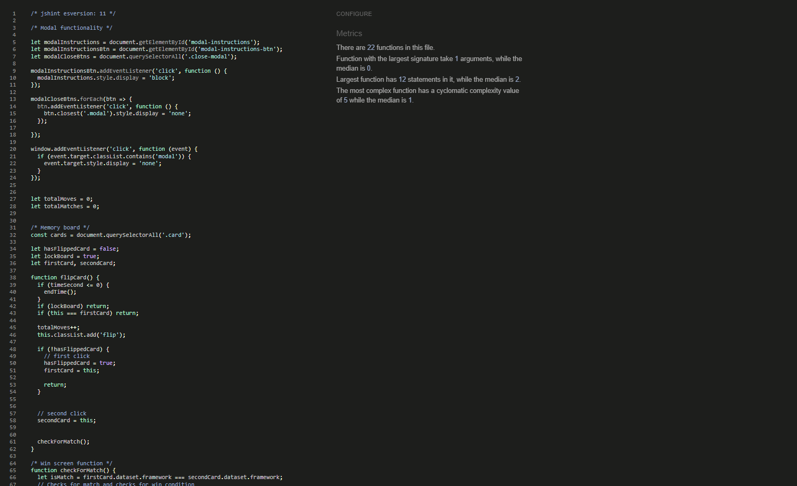
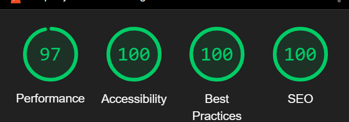

# Testing

Return back to the [README.md](README.md) file.

## Code Validation

### HTML

I have used the recommended [HTML W3C Validator](https://validator.w3.org) to validate all of my HTML files.

| Page | W3C URL | Screenshot | Notes |
| --- | --- | --- | --- |
| Home | [W3C](https://validator.w3.org/nu/?doc=https%3A%2F%2Fjonathan97-web.github.io%2FEevees-evolution%2Findex.html) | 

### CSS

I have used the recommended [CSS Jigsaw Validator](https://jigsaw.w3.org/css-validator) to validate all of my CSS files.

Sample CSS code validation documentation (tables are extremely helpful!):

| File | Jigsaw URL | Screenshot | Notes |
| --- | --- | --- | --- |
| style.css | [Jigsaw](https://jigsaw.w3.org/css-validator/validator?uri=https%3A%2F%2Fjonathan97-web.github.io%2FEevees-evolution) |  | Pass: No Errors |

### JavaScript

I have used the recommended [JShint Validator](https://jshint.com) to validate all of my JS files.

Sample JS code validation documentation (tables are extremely helpful!):

| File | Screenshot | Notes |
| --- | --- | --- |
| script.js |  | Pass: No errors |
| script.js |  | Before/after fixing bug |

## Browser Compatibility

I've tested my deployed project on multiple browsers to check for compatibility issues.

| Browser | Screenshot | Notes |
| --- | --- | --- |
| Chrome |  | Works as expected |
| Firefox Developer Edition |  | Works as expected |
| Edge |  | Works as expected |
| Safari |  | Works as expected |
| Opera GX |  | Works as expected |

## Responsiveness

I've tested my deployed project on multiple devices to check for responsiveness issues.

| Device | Screenshot | Notes |
| --- | --- | --- |
| Mobile (DevTools) |  | Works as expected |
| Tablet (DevTools) |  | Works as expected |
| Desktop (DevTools) |  | Works as expected |
| Desktop|  | Works as expected |
| XL Monitor (DevTools) |  | Works as expected |
| XL Monitor |  | Works as expected |
| 4K Monitor (DevTools) |  | Minor scaling issues |
| iPhone 14 Pro |  | Works as expected |
| Macbook 13" Pro |  | Works as expected |

## Lighthouse Audit

I've tested my deployed project using the Lighthouse Audit tool to check for any major issues.

| Page | Size | Screenshot | Notes |
| --- | --- | --- | --- |
| Home | Mobile |  | Some minor warnings |
| Home | Desktop |  | Some minor warnings |

## Bugs
 

**Fixed Bugs**

- `timeSecond--;` causing countDown to stack so the timer went down way faster when clicking the countdown timer
    - To fix this, I added a `clearInterval(CountDown)` to the StartGame function. 

- Jshint gave error on line 62: Expected an assignment or function call and instead saw an expression.
    - To fix this, I made a complete if statement with an else instead of using the shorthand way.
    

## Unfixed Bugs

- If you click a card several times when already selected a faulty pair sometimes it gets stuck and let you choose more cards without unlocking the already flipped cards.
    - Attempted fix: I haven't found the solution to this yet, I added a timer so that you need to wait 1 second before pressing another card but if you spam you can still go through it, I need more time to find a solution.

There are no remaining bugs that I am aware of.